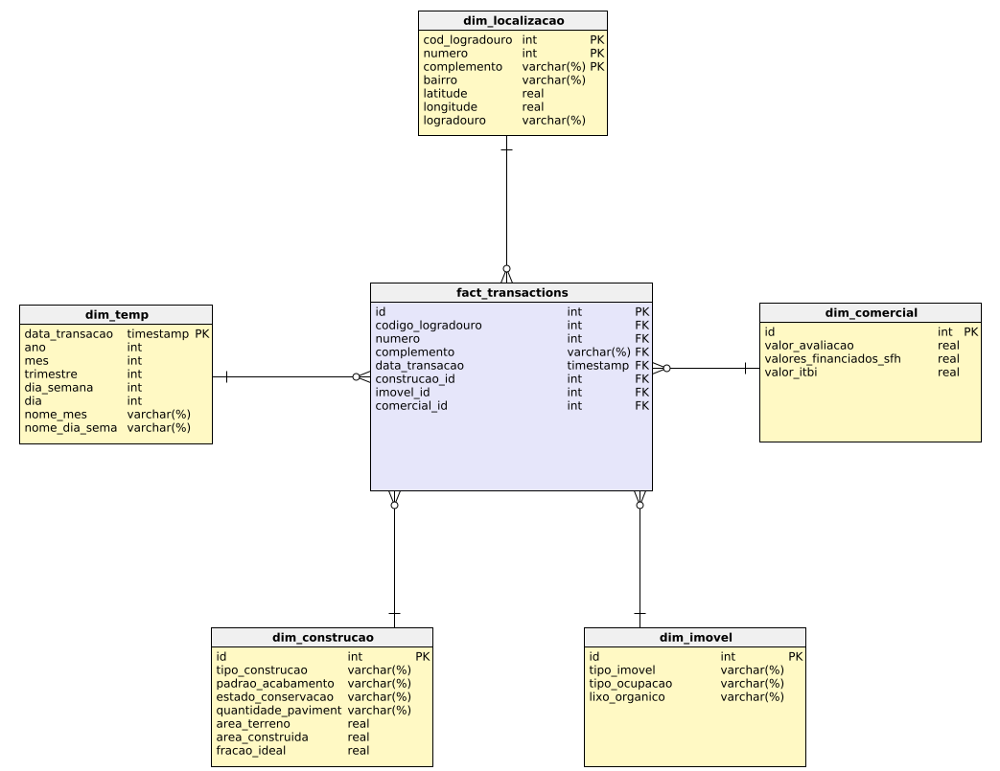
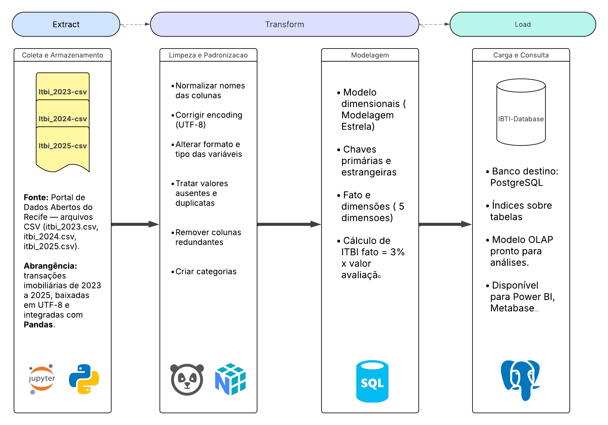
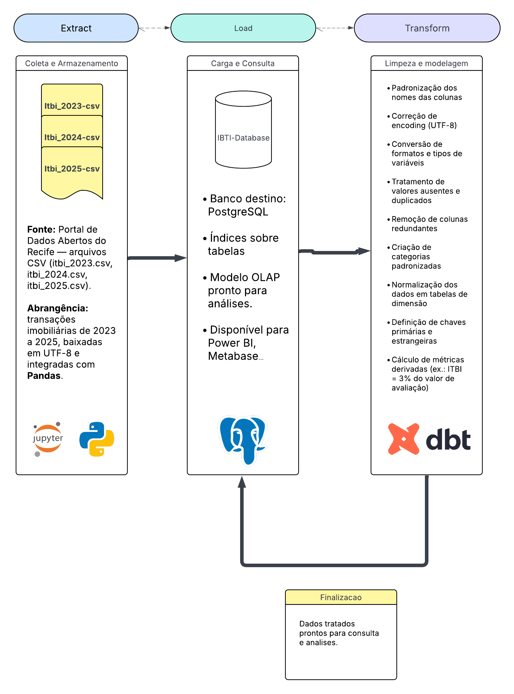

# 🏢 Data Integration Lab — ITBI Recife

## 🎓 Contextualização do Projeto

Este projeto foi desenvolvido para a disciplina de Banco de Dados 2025.1 da Universidade Federal de Pernambuco (UFPE). O objetivo é consolidar, transformar e modelar dados de transações imobiliárias (ITBI) do município de Recife, abrangendo os anos de 2023 a 2025, para análises multidimensionais e geração de insights.

O ITBI (Imposto de Transmissão de Bens Imóveis) é um tributo municipal cobrado sobre a transferência de imóveis. Os dados públicos do ITBI são fundamentais para estudos de mercado, políticas urbanas e análises financeiras.

---

## 📁 Estrutura do Projeto

```text
data-integration-lab/
│
├── README.md
├── datasets/
│   ├── itbi_2023.csv
│   ├── itbi_2024.csv
│   ├── itbi_2025.csv
│   ├── itbi_datasets_recife.zip
│   └── etl_output/
│       ├── etl_metadata.txt
│       ├── itbi_etl_database.db
│       ├── csv/
│       └── summaries/
├── src/
│   ├── elt/
│   │   ├── elt_pipeline_analysis.ipynb
│   │   └── itbi_transactions_analytics/
│   │       ├── dbt_project.yml
│   │       ├── packages.yml
│   │       ├── README.md
│   │       ├── macros/
│   │       ├── models/
│   │       ├── seeds/
│   │       ├── snapshots/
│   │       └── tests/
│   └── etl/
│       ├── etl_pipeline_analysis.ipynb
│       └── itbi-star-schema-2025-08-08_11-29.png
```

---

## 🛠️ Bibliotecas e Tecnologias Utilizadas

- **Python** (pandas, numpy, sqlalchemy, psycopg2, matplotlib, seaborn)
- **Jupyter Notebook**
- **dbt** (Data Build Tool)
- **PostgreSQL**
- **Power BI / Metabase** (para visualização)
- **Arquivos CSV**
- **Macros dbt customizadas** para automação das transformações


---

<div align="center">
  <!-- Principais tecnologias utilizadas -->
  
  
  
  
  
  
  
  
</div>


---

## 🚀 Instruções de Instalação

1. **Clone o repositório**
   ```sh
   git clone https://github.com/arllindosp/data-integration-lab.git
   cd data-integration-lab
   ```

2. **Crie e ative um ambiente virtual**
   ```sh
   python -m venv .venv
   .venv\Scripts\activate  # Windows
   # OU
   source .venv/bin/activate  # Linux/Mac
   ```

3. **Instale as dependências Python globais**
   ```sh
   pip install -r requirements.txt
   ```

4. **Instalação específica do dbt para o diretório de análise de transações**
   ```sh
   # Navegue para o diretório específico do dbt
   cd src/elt/itbi_transactions_analytics
   
   # Instale o dbt DENTRO deste diretório (obrigatório)
   pip install dbt-core dbt-postgres
   
   # Inicialize o projeto dbt (se necessário)
   dbt init
   
   # Volte ao diretório raiz
   cd ../../../
   ```
   
   > ⚠️ **ATENÇÃO**: Todos os comandos dbt (dbt run, dbt test, etc.) DEVEM ser executados dentro do diretório `src/elt/itbi_transactions_analytics`. Caso contrário, o projeto dbt não funcionará corretamente.

5. **Configuração do arquivo profiles.yml do dbt**
   
   É necessário configurar o arquivo `profiles.yml` do dbt para a conexão com o banco de dados.
   
   **No Linux/Mac**:
   ```sh
   # Edite o arquivo
   nano ~/.dbt/profiles.yml
   ```
   
   **No Windows**:
   ```sh
   # O arquivo deve estar em:
   C:\Users\SEU_USUARIO\.dbt\profiles.yml
   
   # Você pode abrir com o Notepad:
   notepad %USERPROFILE%\.dbt\profiles.yml
   ```
   
   **Adicione o seguinte conteúdo ao profiles.yml**:
   ```yaml
   itbi_transactions_analytics:  # IMPORTANTE: Este nome deve corresponder exatamente ao nome do projeto dbt
     target: dev
     outputs:
       dev:
         type: postgres
         host: localhost         # Ajuste conforme seu ambiente
         user: seu_usuario       # Ajuste conforme seu ambiente
         password: sua_senha     # Ajuste conforme seu ambiente
         port: 5432              # Ajuste conforme seu ambiente
         dbname: seu_banco       # Ajuste conforme seu ambiente
         schema: analytics       # IMPORTANTE: Este schema deve ser mantido como "analytics"
         threads: 4
         keepalives_idle: 0
   ```
   
   > 🔑 **IMPORTANTE**: 
   > - O nome do perfil `itbi_transactions_analytics` deve ser mantido exatamente como está
   > - O schema `analytics` deve ser mantido exatamente como está
   > - Os demais valores (host, user, password, port, dbname) podem e devem ser ajustados conforme sua instalação do PostgreSQL

6. **Instalação de pacotes para notebooks ETL/ELT (caso ocorra problemas)**
   ```sh
   # Para o notebook ETL
   cd src/etl
   pip install pandas numpy matplotlib seaborn sqlalchemy psycopg2-binary zipfile36 tqdm
   
   # Para o notebook ELT
   cd ../elt
   pip install pandas numpy psycopg2-binary sqlalchemy matplotlib seaborn
   
   # Volte ao diretório raiz
   cd ../../
   ```

7. **Configure o PostgreSQL**
   - Crie um banco de dados chamado `elt_pipeline`
   - Ajuste as credenciais no arquivo `config.json` conforme seu ambiente

8. **Execute o pipeline**
   - **Para análise ETL**: 
     ```sh
     # Basta executar o notebook ETL
     jupyter notebook src/etl/etl_pipeline_analysis.ipynb
     ```
   
   - **Para análise ELT**: 
     ```sh
     # 1. Primeiro, execute o notebook ELT
     jupyter notebook src/elt/elt_pipeline_analysis.ipynb
     
     # 2. Em seguida, execute os comandos dbt NO DIRETÓRIO itbi_transactions_analytics:
     cd src/elt/itbi_transactions_analytics
     dbt run
     dbt test
     ```
     **IMPORTANTE**: Os comandos dbt DEVEM ser executados dentro do diretório `itbi_transactions_analytics`

9. **Visualize os dados**
   - Conecte o banco ao Power BI ou Metabase para dashboards

---

## 🌟 Modelagem Estrela

A modelagem estrela foi adotada para facilitar análises sistemáticas. Ela consiste em uma tabela fato central (transações imobiliárias) e cinco dimensões principais:

- **dim_localizacao**: bairro, CEP, latitude, longitude
- **dim_tempo**: data, ano, mês, trimestre, dia_da_semana
- **dim_construcao**: qtd_pavimentos, area_total, area_util, tipo_estrutura
- **dim_imovel**: tipo_imovel, padrao_acabamento, estado_conservacao
- **dim_comercial**: valor_avaliacao, valor_transacao, valor_financiado, itbi_calculado

### Diagrama:



---

## 🔄 Fluxo ETL

O processo ETL tradicional segue as etapas:

1. **Extract**: Coleta dos arquivos CSV do portal de dados abertos
2. **Transform**: Limpeza, padronização, normalização e enriquecimento dos dados
3. **Load**: Carga dos dados tratados no banco PostgreSQL

### Diagrama


---

## 🔁 Fluxo ELT

O processo ELT adotado neste projeto segue:

1. **Extract**: Coleta e armazenamento dos dados brutos
2. **Load**: Carga dos dados brutos no banco PostgreSQL
3. **Transform**: Transformações e modelagem realizadas diretamente no banco, utilizando dbt e macros SQL

### Diagrama



---

## ⚖️ Comparação ETL vs ELT

| Aspecto         | ETL (Extract, Transform, Load) | ELT (Extract, Load, Transform) |
|-----------------|-------------------------------|-------------------------------|
| Transformação   | Antes da carga                | Após a carga                  |
| Performance     | Limitada pelo ambiente local  | Aproveita o poder do banco    |
| Flexibilidade   | Menor                         | Maior, com SQL/dbt/macros     |
| Auditoria       | Menos rastreável              | Mais rastreável               |
| Ferramentas     | Python, pandas                | dbt, SQL, macros, PostgreSQL  |

---

## 📖 Dicionário de Dados

Este dicionário de dados descreve o modelo estrela utilizado para análise de transações imobiliárias do Recife. Os datasets são compostos por tabelas de dimensão e fato, permitindo análises detalhadas sobre localização, tempo, características do imóvel, aspectos comerciais e construção.

### 📍 dim_localizacao

| Campo           | Tipo      | Descrição                                       |
|-----------------|-----------|------------------------------------------------|
| cod_logradouro  | int       | Código do logradouro                            |
| numero          | int       | Número do imóvel                                |
| complemento     | varchar   | Complemento do endereço (apto, bloco, etc.)     |
| bairro          | varchar   | Bairro do imóvel                                |
| latitude        | real      | Latitude do imóvel                              |
| longitude       | real      | Longitude do imóvel                             |
| logradouro      | varchar   | Nome do logradouro                              |

### 📅 dim_tempo

| Campo            | Tipo      | Descrição                                |
|------------------|-----------|------------------------------------------|
| data_transacao   | timestamp | Data da transação imobiliária            |
| ano              | int       | Ano da transação                         |
| mes              | int       | Mês da transação                         |
| trimestre        | int       | Trimestre da transação                   |
| dia_semana       | int       | Dia da semana da transação               |
| dia              | int       | Dia do mês da transação                  |
| nome_mes         | varchar   | Nome do mês da transação                 |
| nome_dia_semana  | varchar   | Nome do dia da semana da transação       |

### 💰 dim_comercial

| Campo                  | Tipo      | Descrição                               |
|------------------------|-----------|----------------------------------------|
| id                     | int       | Identificador da dimensão comercial     |
| valor_avaliacao        | real      | Valor de avaliação do imóvel            |
| valores_financiados_sfh| real      | Valores financiados pelo SFH            |
| valor_itbi             | real      | Valor do ITBI da transação              |

### 🏗️ dim_construcao

| Campo                | Tipo      | Descrição                                                        |
|----------------------|-----------|------------------------------------------------------------------|
| id                   | int       | Identificador da dimensão construção                              |
| tipo_construcao      | varchar   | Tipo de construção do imóvel                                     |
| padrao_acabamento    | varchar   | Padrão de acabamento do imóvel                                   |
| estado_conservacao   | varchar   | Estado de conservação do imóvel                                  |
| quantidade_paviment  | varchar   | Quantidade de pavimentos do imóvel                               |
| area_terreno         | real      | Área do terreno do imóvel                                        |
| area_construida      | real      | Área construída do imóvel                                        |
| fracao_ideal         | real      | Parte ideal que o imóvel representa em relação ao todo           |

### 🏠 dim_imovel

| Campo          | Tipo      | Descrição                                                 |
|----------------|-----------|-----------------------------------------------------------|
| id             | int       | Identificador da dimensão imóvel                           |
| tipo_imovel    | varchar   | Tipo de imóvel (apartamento, casa, etc.)                  |
| tipo_ocupacao  | varchar   | Tipo de ocupação do imóvel (residencial, comercial, etc.) |
| lixo_organico  | varchar   | Indicador de coleta de lixo orgânico                      |

### 📊 fact_transactions

| Campo             | Tipo      | Descrição                                              |
|-------------------|-----------|--------------------------------------------------------|
| id                | int       | Identificador da transação                             |
| codigo_logradouro | int       | Código do logradouro                                   |
| numero            | int       | Número do imóvel                                       |
| complemento       | varchar   | Complemento do endereço                                |
| data_transacao    | timestamp | Data da transação                                      |
| construcao_id     | int       | Chave estrangeira para a dimensão construção           |
| imovel_id         | int       | Chave estrangeira para a dimensão imóvel               |
| comercial_id      | int       | Chave estrangeira para a dimensão comercial            |

---

## � Análises e Insights

<!-- Seção reservada para análises e insights dos dados -->

---

## �📚 Referências e Recursos

- [Documentação dbt](https://docs.getdbt.com/docs/introduction)
- [Dados Abertos Recife](http://dados.recife.pe.gov.br/)
- [Power BI](https://powerbi.microsoft.com/)
- [Metabase](https://www.metabase.com/)

---

## 💡 Observações Finais

Este projeto foi desenvolvido para a disciplina de Banco de Dados 2025.1 da UFPE, voltado para aprendizado e aplicação de conceitos de engenharia de dados. Para dúvidas, sugestões ou colaborações, entre em contato com o responsável pelo repositório.

## 📝 Licença

Este projeto está licenciado sob a [Licença MIT](LICENSE) - veja o arquivo LICENSE para detalhes.

---


